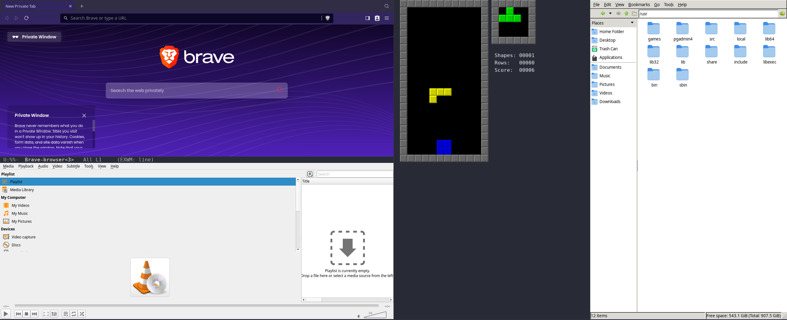

* Noteditor

*Noteditor* is an open-source, all-in-one window manager and text editor designed to streamline your development experience.
Powered by *Emacs* and on the foundation of *FG42*, and *EXWM*.

All dependencies — both Emacs packages and the external command-line tools
noteditor uses — are provided by *Nix* at build time. There is nothing to
download at runtime and no global state to manage.

** Requirements
- Nix with flakes enabled (=experimental-features = nix-command flakes=)

** Try it without installing
#+BEGIN_SRC bash
# Editor mode
$ nix run github:yottanami/noteditor

# Window-manager mode
$ nix run github:yottanami/noteditor#wm
#+END_SRC

** Install on NixOS (as a window-manager session)
Add noteditor to your flake inputs and enable the module. It then shows up in
your display manager's session list like any other window manager.
#+BEGIN_SRC nix
{
  inputs.noteditor.url = "github:yottanami/noteditor";

  # In your NixOS configuration:
  imports = [ inputs.noteditor.nixosModules.default ];
  nixpkgs.overlays = [ inputs.noteditor.overlays.default ];
  programs.noteditor.enable = true;
}
#+END_SRC

** Install into a profile
#+BEGIN_SRC bash
$ nix profile install github:yottanami/noteditor
$ noteditor        # editor mode
$ noteditor-wm     # window-manager mode
#+END_SRC

** Build locally
#+BEGIN_SRC bash
$ git clone https://github.com/yottanami/noteditor
$ cd noteditor
$ nix build            # result/bin/noteditor and result/bin/noteditor-wm
# or, without flakes:
$ nix-build
#+END_SRC

** Configuration
*** User overrides
Drop a =noteditor-user.el= in any of these locations (first match wins) to
extend or override the configuration without touching the package:
- =$XDG_CONFIG_HOME/noteditor/noteditor-user.el=
- =~/.noteditor/noteditor-user.el=

*** Adding extra runtime tools
Browsers, media players and terminals that are unfree or not in nixpkgs
(e.g. brave, plexamp, alacritty) are not bundled. Add them with
=extraRuntimeInputs=:
#+BEGIN_SRC nix
noteditor.override {
  extraRuntimeInputs = with pkgs; [ brave alacritty ];
}
#+END_SRC

*** Environment variables
| =NOTEDITOR_HOME=  | Pathname of Noteditor (set by the launcher)        |
| =NOTEDITOR_WM=    | =true= for window-manager mode, =false= for editor |
| =NOTEDITOR_DEBUG= | =true= to abort loudly on load errors              |

** Keybindings
*** Fast dial keybindings
| =s-d= | Launch applications |
| =s-x= | Terminal            |
| =s-l= | Screen lock         |
| =s-s= | Screenshot app      |
| =s-m= | Media player        |
| =s-b= | Browser             |

*** Other keybindings
| =s-t= |  tab-bar-mode  |

** Plugins
*** wm
  Window manager based on EXWM
*** editor
  Anything that is needed to write code!
*** theme
  Fonts, colors and more
*** org
  org-mode, org-roam and other related modes
